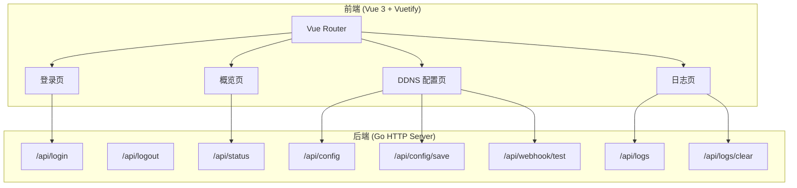

## 1. 架构设计



## 2. 技术说明

- 前端：Vue 3 + Vuetify 3 + Vite + TypeScript
- 初始化工具：vite-init (vue-ts 模板)
- 后端：Go HTTP Server（已有）
- 构建产物：`web/dist/` 目录，由 Go embed 嵌入

## 3. 路由定义

| 路由 | 用途 |
|------|------|
| /login | 登录页 |
| / | 概览页（需认证） |
| /ddns | DDNS 配置页（需认证） |
| /logs | 日志页（需认证） |

## 4. API 定义

### 4.1 认证相关

```typescript
// GET /api/login - 检查登录状态
interface LoginStatus {
  needSetup: boolean // 是否需要首次设置
}

// POST /api/login - 登录
interface LoginRequest {
  username: string
  password: string
}
interface LoginResponse {
  token: string
}

// POST /api/logout - 登出
```

### 4.2 系统状态

```typescript
// GET /api/status - 获取系统状态
interface SystemStatus {
  version: string
  username: string
}
```

### 4.3 配置管理

```typescript
// GET /api/config - 获取配置
interface DnsConfig {
  name: string
  dnsName: string
  dnsId: string
  dnsSecret: string
  dnsExtParam: string
  ttl: string
  ipv4Enable: boolean
  ipv4GetType: string
  ipv4Url: string
  ipv4NetInterface: string
  ipv4Cmd: string
  ipv4Domains: string
  ipv6Enable: boolean
  ipv6GetType: string
  ipv6Url: string
  ipv6NetInterface: string
  ipv6Cmd: string
  ipv6Reg: string
  ipv6Domains: string
  httpInterface: string
}

interface NetInterface {
  name: string
  address: string[]
}

interface AppConfig {
  dnsConf: DnsConfig[]
  notAllowWanAccess: boolean
  username: string
  webhookUrl: string
  webhookRequestBody: string
  webhookHeaders: string
  ipv4Interfaces: NetInterface[]
  ipv6Interfaces: NetInterface[]
}

// POST /api/config/save - 保存配置
interface SaveConfigRequest {
  username: string
  password: string
  notAllowWanAccess: boolean
  webhookUrl: string
  webhookRequestBody: string
  webhookHeaders: string
  dnsConf: DnsConfig[]
}
```

### 4.4 日志

```typescript
// GET /api/logs - 获取日志
type Logs = string[]

// POST /api/logs/clear - 清除日志
```

### 4.5 Webhook

```typescript
// POST /api/webhook/test - 测试 Webhook
interface WebhookTestRequest {
  url: string
  requestBody: string
  headers: string
}
```

## 5. 项目结构

```
web/
├── src/
│   ├── App.vue
│   ├── main.ts
│   ├── router/
│   │   └── index.ts
│   ├── composables/
│   │   └── useApi.ts
│   ├── pages/
│   │   ├── LoginPage.vue
│   │   ├── DashboardPage.vue
│   │   ├── DdnsPage.vue
│   │   └── LogsPage.vue
│   └── plugins/
│       └── vuetify.ts
├── index.html
├── package.json
├── vite.config.ts
└── tsconfig.json
```

## 6. 构建与部署

- 开发：`npm run dev` 启动 Vite 开发服务器
- 构建：`npm run build` 输出到 `web/dist/`
- 部署：Go 通过 `//go:embed all:web/dist` 嵌入静态文件
